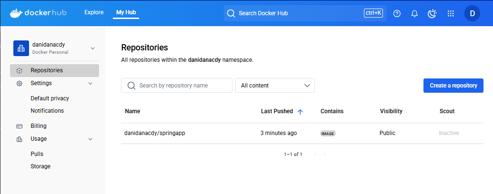
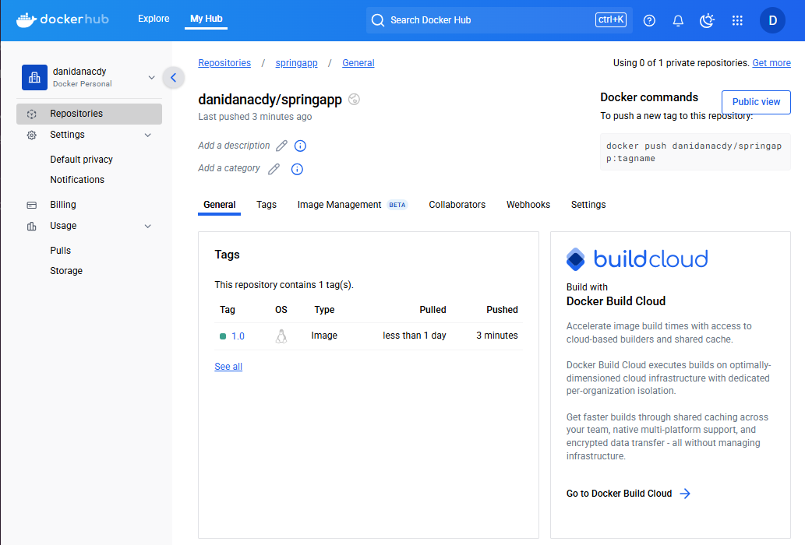

# Docker-in-ubuntu

## 🚦목차
<a href="#개요">1. 개요</a><br>
<a href="#프로젝트-설명">2. 프로젝트 설명</a><br>
<a href="#팀원">3. 팀원</a><br>
<a href="#활용-기술">4. 활용 기술</a><br>
<a href="#구현">5. 구현</a><br>
<a href="#트러블-슈팅">6. 트러블 슈팅</a><br>
<a href="#회고">7. 회고</a><br>

## 🖥️**개요**

## 📒**프로젝트 설명**

## 👊**팀원**
<table>
  <tbody>
    <tr>
      <td align="center">
         <a href="https://github.com/danidana2">
          
          <br /><sub><b> 최다영 </b></sub>
        </a>
        <br />
      </td>
      <td align="center">
          <a href="https://github.com/woody6624">
          
          <br /><sub><b> 김우현 </b></sub>
        </a>
        <br />
      </td>
  </tbody>
</table>

## 🔍**활용 기술**
<table style="border-collapse: collapse;">
<tr>
    <td></td>
</tr>
</table>

## **구현**
### Dockerfile
```bash
# 1. 가벼운 JRE 기반 이미지 사용 (최소한의 실행 환경)
FROM eclipse-temurin:17-jre-alpine

# 2. 작업 디렉토리 설정
WORKDIR /app

#3. 로컬에서 빌드된 JAR 파일을 컨테이너로 복사
COPY ./springapp.jar springapp.jar

#4. 포트번호
EXPOSE 8081

#4. 작동
ENTRYPOINT ["java", "-jar", "springapp.jar"]
```
### 애플리케이션 파일 준비
Spring 애플리케이션을 Docker로 배포하기 위해 필요한 파일들을 준비합니다.
```bash
ubuntu@myserver01:~/springImg$ ls
Dockerfile  springapp.jar
```
### Docker 이미지 빌드
Spring 애플리케이션을 포함한 Docker 이미지를 생성합니다.
```bash
ubuntu@myserver01:~/springImg$ docker build -t springapp .
```
### 생성된 Docker 이미지 확인
```bash
ubuntu@myserver01:~/springImg$ docker images
REPOSITORY            TAG       IMAGE ID       CREATED          SIZE
springapp             latest    a1a78cf3c43f   2 minutes ago    205MB
```
### 태그 변경 후 Docker Hub에 푸시 준비
```bash
ubuntu@myserver01:~/springImg$ docker tag springapp:latest danidanacdy/springapp:1.0
```
### 태그 변경 확인
```bash
ubuntu@myserver01:~/springImg$ docker images
REPOSITORY              TAG       IMAGE ID       CREATED          SIZE
danidanacdy/springapp   1.0       a1a78cf3c43f   7 minutes ago    205MB
springapp               latest    a1a78cf3c43f   7 minutes ago    205MB
```
### Docker Hub에 푸시
```bash
ubuntu@myserver01:~/springImg$ docker push danidanacdy/springapp:1.0
The push refers to repository [docker.io/danidanacdy/springapp]
d5554d6cc319: Pushed
20d0fa9040fa: Pushed
872b4640f1c3: Mounted from library/eclipse-temurin
b1bdb6e103f3: Mounted from library/eclipse-temurin
30e00ad713b7: Mounted from library/eclipse-temurin
1cd01d0f38a4: Mounted from library/eclipse-temurin
08000c18d16d: Mounted from library/eclipse-temurin
1.0: digest: sha256:40cc7f8a084e1d2afa4ae360dcf7e7b48494e581a7e26a323443d8c2f009dac1 size: 1785
```



### 다른 서버에서 Docker Hub에 올린 이미지 가져오기
```bash
ubuntu@myserver01:~$ docker pull danidanacdy/springapp:1.0
1.0: Pulling from danidanacdy/springapp
f18232174bc9: Pull complete
e6cc66ba0a96: Pull complete
d2830fdce3f8: Pull complete
d359e0dcce06: Pull complete
51631fe5dc90: Pull complete
8bb28b7b32ad: Pull complete
aa154074f5a8: Pull complete
Digest: sha256:40cc7f8a084e1d2afa4ae360dcf7e7b48494e581a7e26a323443d8c2f009dac1
Status: Downloaded newer image for danidanacdy/springapp:1.0
docker.io/danidanacdy/springapp:1.0
```
### 다운로드된 이미지 확인
```bash
ubuntu@myserver01:~$ docker images
REPOSITORY              TAG       IMAGE ID       CREATED          SIZE
danidanacdy/springapp   1.0       a1a78cf3c43f   27 minutes ago   205MB
```
### 컨테이너 실행
```bash
ubuntu@myserver01:~$ docker run -d -p 8081:8081 --name daniSpringApp danidanacdy/springapp:1.0
66394cecd5bcbb4503cf475d2c37e2f43ac91481aed4c6ee1c61c7a3998efc4e
```
### 실행 중인 컨테이너 확인
```bash
ubuntu@myserver01:~$ docker ps
CONTAINER ID   IMAGE                       COMMAND                  CREATED         STATUS         PORTS                                         NAMES
66394cecd5bc   danidanacdy/springapp:1.0   "java -jar springapp…"   6 minutes ago   Up 6 minutes   0.0.0.0:8081->8081/tcp, [::]:8081->8081/tcp   daniSpringApp
```

### 다른 사용자 Docker Hub에서 이미지 가져오기
```bash
ubuntu@myserver01:~$ docker pull woody6624/springapp:1.0
1.0: Pulling from woody6624/springapp
f18232174bc9: Already exists
e6cc66ba0a96: Already exists
d2830fdce3f8: Already exists
d359e0dcce06: Already exists
51631fe5dc90: Already exists
59ac075c6e11: Pull complete
7b63dd6d2533: Pull complete
Digest: sha256:a60c77cc13e3397d1cd9d68061afcbcfb6aa7ab0295a098dc27a367565553b6c
Status: Downloaded newer image for woody6624/springapp:1.0
docker.io/woody6624/springapp:1.0
```
### 다운로드된 이미지 확인
```bash
ubuntu@myserver01:~$ docker images
REPOSITORY              TAG       IMAGE ID       CREATED          SIZE
danidanacdy/springapp   1.0       a1a78cf3c43f   38 minutes ago   205MB
woody6624/springapp     1.0       70351ec7fa08   2 hours ago      205MB
```
### 컨테이너 실행 (다른 포트 사용)
```bash
ubuntu@myserver01:~$ docker run -d -p 8082:8079 --name woodySpringApp woody6624/springapp:1.0
7faa8fdfccd3adbe00fb043aa79672e3359b25f4bbaf0f755bdca7f5ed8909b5
```
### 실행 중인 컨테이너 확인
```bash
ubuntu@myserver01:~$ docker ps
CONTAINER ID   IMAGE                       COMMAND                  CREATED          STATUS          PORTS                                                   NAMES
7faa8fdfccd3   woody6624/springapp:1.0     "java -jar springapp…"   53 seconds ago   Up 52 seconds   8081/tcp, 0.0.0.0:8082->8079/tcp, [::]:8082->8079/tcp   woodySpringApp
66394cecd5bc   danidanacdy/springapp:1.0   "java -jar springapp…"   11 minutes ago   Up 11 minutes   0.0.0.0:8081->8081/tcp, [::]:8081->8081/tcp             daniSpringApp
```

## **트러블 슈팅**

## **회고**
